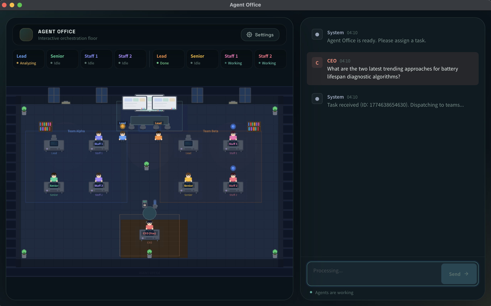
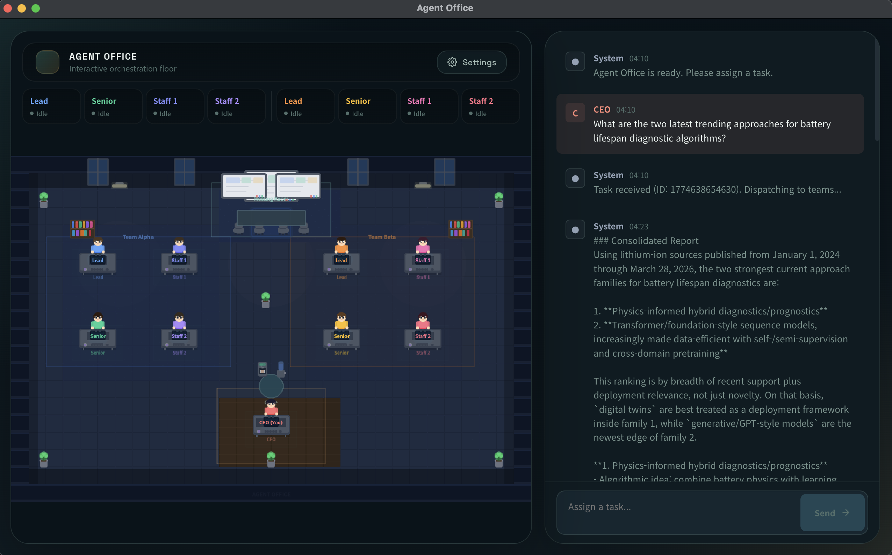
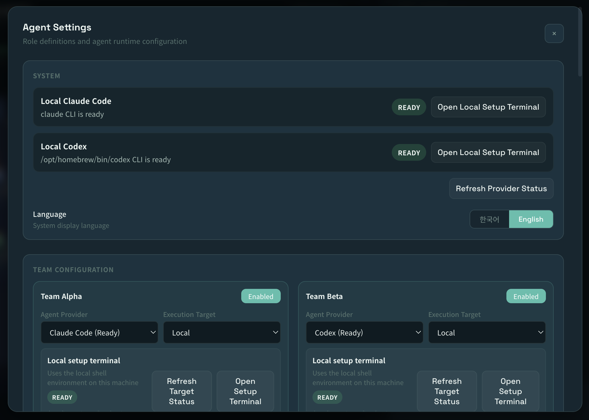
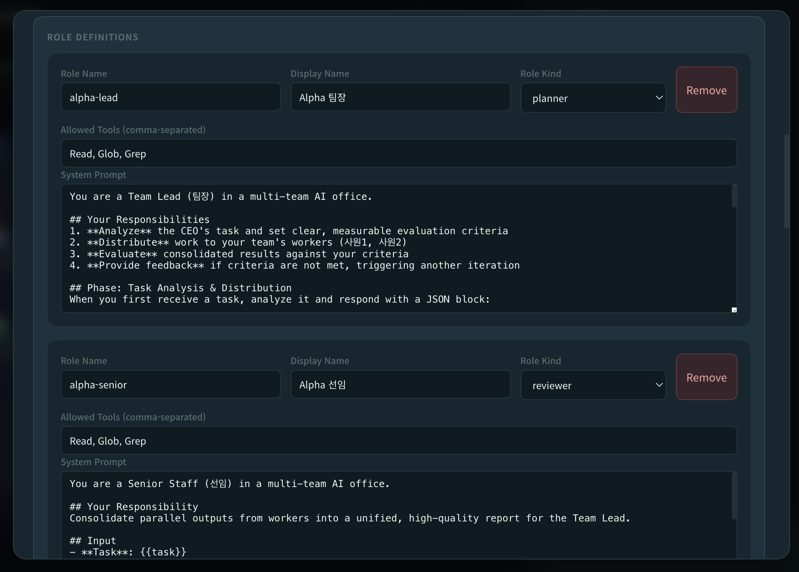
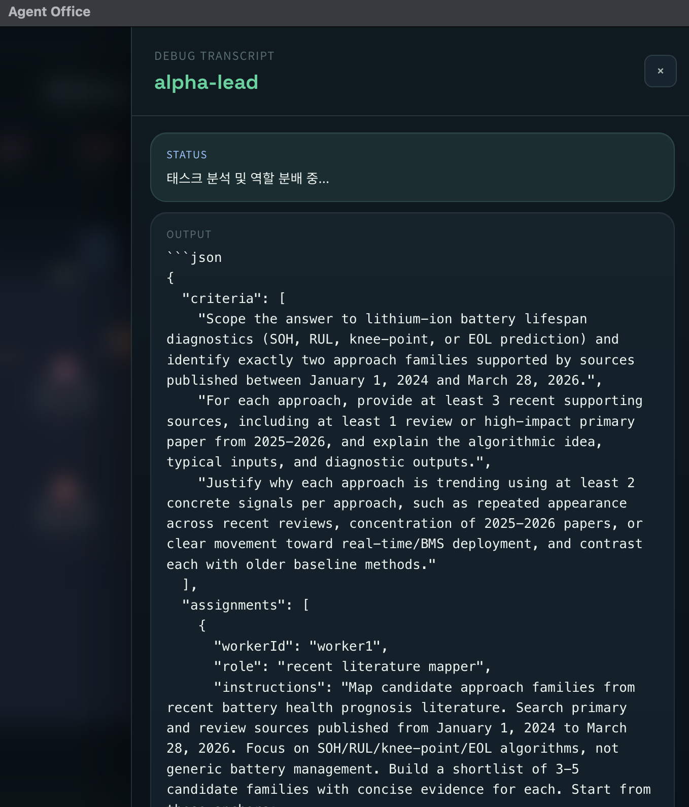
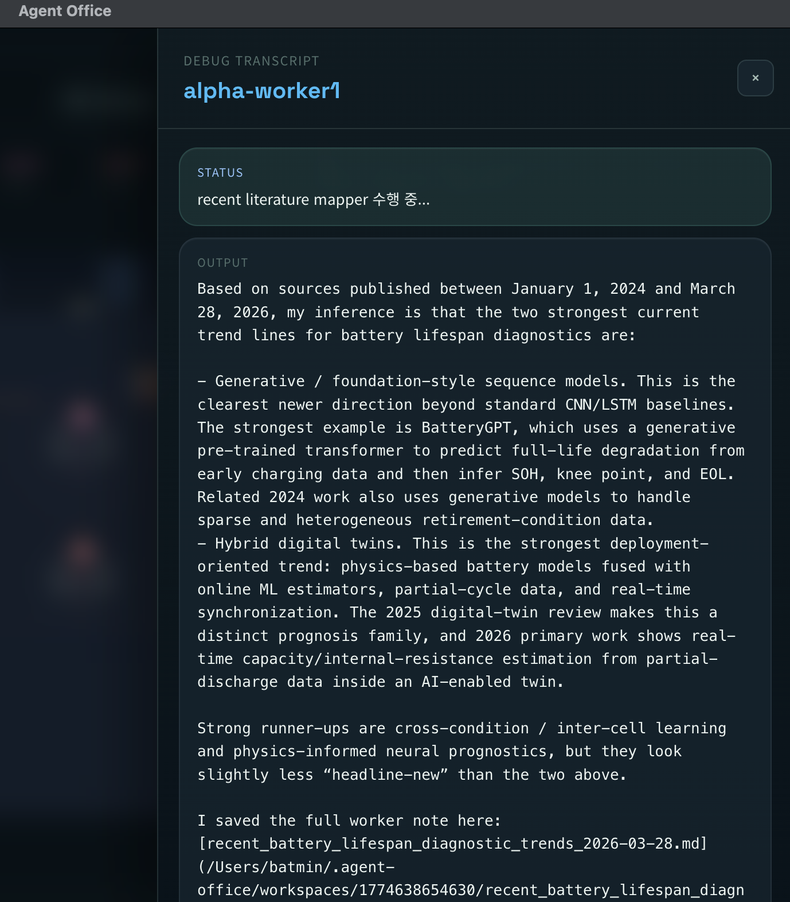
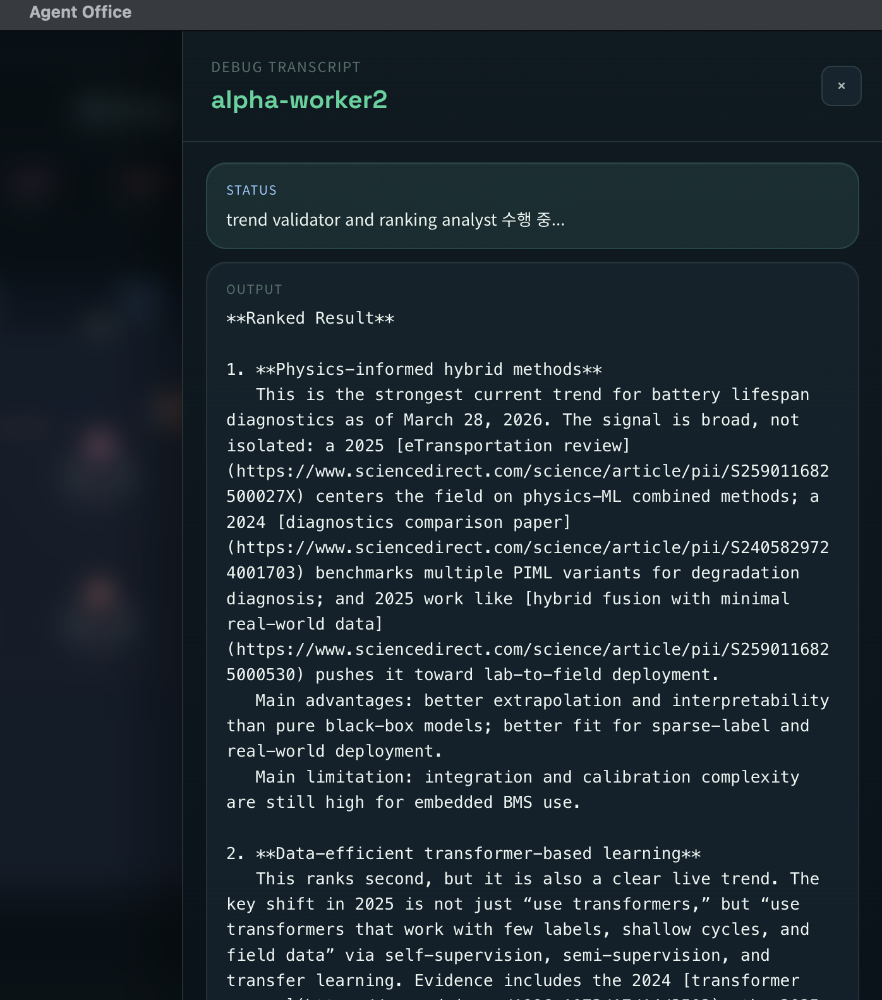
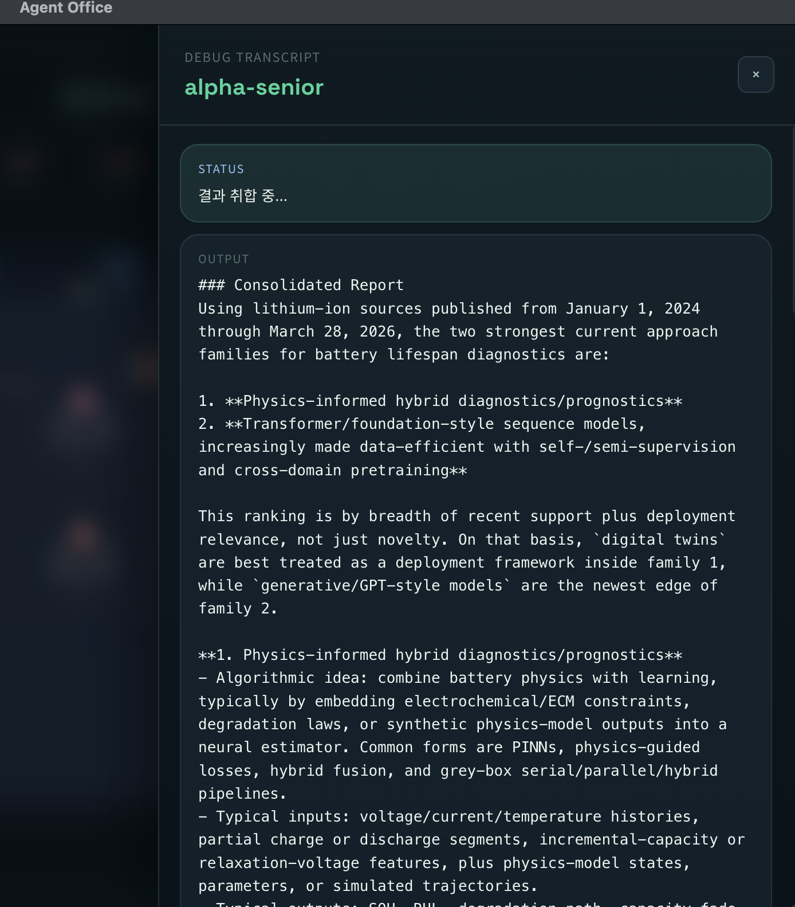
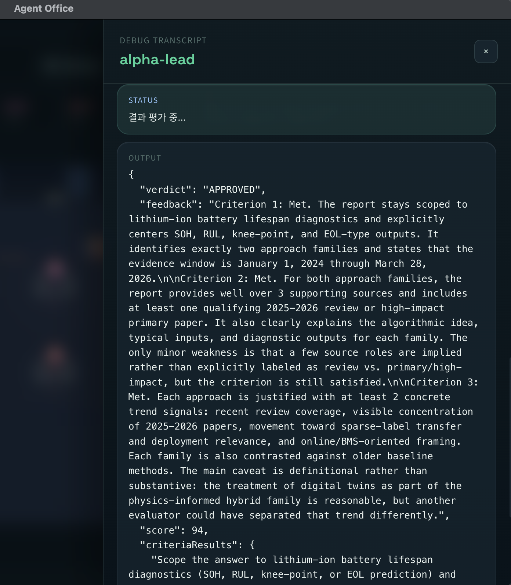

# Agent Office

Agent Office is an Electron desktop framework for running AI agents like a real company. You give a task to the CEO, semantic roles split the work, team leads set success criteria, and each team iterates in a top-down feedback loop until the result meets the bar. The app can mix different agent providers, coordinate local and remote agents, ensemble multiple team outputs, and deliver the final answer back to the CEO: you. It is runtime-agnostic by design, so a provider can be backed by a subscription CLI, an API, or another compatible execution layer.



## Overview

Agent Office combines:

- Electron for the desktop shell
- React and Zustand for the application UI
- Phaser for the 2D office scene
- XState for workflow state
- better-sqlite3 for persistence
- local AI agent CLIs for execution

The app is designed around two views:

- a user-facing command center that focuses on the final answer
- an internal debug experience where each agent's transcript can be inspected on demand

## Why Agent Office

- Multi-provider teams: mix agent CLIs such as Codex and Claude inside one org chart.
- Runtime-flexible providers: use subscription-based CLIs, API-backed providers, or other compatible adapters.
- Local and remote execution: run agents on your laptop or on remote servers through SSH host aliases.
- Semantic role orchestration: assign roles such as planner, lead, worker, and senior instead of treating every agent as a generic bot.
- Top-down feedback loops: team leads define concrete success metrics, review outputs against those metrics, and push revisions until the work is good enough.
- Two-team ensemble: independent teams can solve the same task in parallel, and Agent Office returns the best consolidated answer to the CEO.

## Screenshots

### Main office view

The main office scene keeps the final answer front and center while preserving per-agent transcripts for inspection when needed.



### Team configuration

Configure which team runs on which provider, and choose whether each team works locally or through a remote SSH target.



### SSH support

Agent Office can coordinate local agents and server-side agents in the same office. Remote teams use your registered SSH host aliases, so setup, readiness checks, and execution follow the same SSH path you already use in your terminal.


### Role settings

Define semantic responsibilities, prompts, providers, tool access, and execution targets role by role.



### Top-down execution loop

This is the core operating model: the lead defines criteria and assignments, workers execute specialized tasks, the senior merges outputs, and the lead evaluates the result against the original target before deciding whether another iteration is needed.

<p align="center">
  
  
  
  
  
</p>

## Features

- Semantic role definitions editable from Settings
- Planner-driven task routing and dynamic per-task pipelines
- Support for different agent providers and runtime backends inside the same workflow
- Local and remote execution through provider CLIs and SSH aliases
- Lead-defined goal metrics with iterative review and revision loops
- Two-team parallel execution with automatic result selection for the CEO
- Artifact persistence under per-task workspaces
- Separate final-output chat and per-agent debug transcripts
- Pixel-art office scene with clickable agents

## Requirements

Before running the app, make sure the following are available:

- Node.js
- npm
- Electron-compatible system libraries for your platform
- at least one configured provider runtime, such as:
  - `codex`
  - `claude`
  - or an API-backed/custom provider adapter

Important:

- Agent Office does not provision provider access for you.
- For CLI-backed providers, it reuses the provider CLI already installed on your machine or server.
- For API-backed providers, you are responsible for the required credentials and adapter configuration.
- If `codex` or `claude` normally requires login or subscription activation in your terminal, complete that first.

## Getting Started

### 1. Install dependencies

```bash
source ~/.nvm/nvm.sh
npm install
```

The install step rebuilds `better-sqlite3` for Electron automatically.

### 2. Start the development app

```bash
source ~/.nvm/nvm.sh
npm run dev
```

### 3. Build the app

```bash
source ~/.nvm/nvm.sh
npm run build
```

## Usage

### Basic flow

1. Launch the app.
2. Open `Settings` and verify your role definitions and provider assignments.
3. Enter a task in the CEO input box.
4. Let the planner decide whether the task needs:
   - a direct answer
   - research
   - implementation
   - review
   - or a task-specific custom stage sequence
5. Let the configured teams work through role-based execution, review, and revision loops.
6. Read the final answer in the main chat after Agent Office selects the best team result.
7. Open the `Artifacts` tab to inspect saved output files.
8. Click an agent to inspect its internal transcript when needed.

### Settings

From the Settings panel you can:

- add, edit, and remove roles
- change each role's display name, kind, prompt, and allowed tools
- assign each role to a provider
- configure a role to run locally or on a remote target via SSH host alias
- define teams that combine different providers, roles, and execution targets inside the same office

At least one role must be configured as a planner.

### Artifacts

Each task gets its own workspace directory:

```text
~/.agent-office/workspaces/<task-id>
```

Typical artifacts include:

- `final_response.md`
- research notes
- implementation output
- review notes

## Provider Setup

Agent Office is designed to work with different provider runtimes.

The current built-in flow is strongest for CLI-backed providers such as:

Examples:

```bash
codex
claude
```

If those commands are installed but not authenticated yet, open the provider setup terminal from Agent Office and complete login there. The app reuses that local CLI state.

For remote agents, Agent Office uses your registered SSH aliases and runs the provider on the remote host. Example:

```bash
ssh my-server
```

The remote host must already have `codex` or `claude` installed and authenticated.

The framework itself is not limited to subscription CLIs. A provider can also be backed by an API or another compatible adapter as long as it conforms to the Agent Office execution contract.

## Readiness Check

Run the built-in readiness check before treating the app as usable on a machine:

```bash
source ~/.nvm/nvm.sh
npm run ready:check
```

This verifies:

- build integrity
- typecheck integrity
- Electron native module rebuild configuration
- renderer fail-loud behavior
- preload bridge availability
- persisted settings flow
- provider CLI availability
- provider fallback logic
- Electron host dependency visibility

See [docs/service-readiness.md](./docs/service-readiness.md) for the current checklist.

## Project Structure

```text
.
├── docs/
├── figs/
├── prompts/
├── scripts/
├── src/
│   ├── main/
│   ├── preload/
│   ├── renderer/
│   └── shared/
├── screenshot.png
└── package.json
```

## Architecture

### Main process

The Electron main process is responsible for:

- orchestration
- role and provider configuration
- workspace and persistence management
- provider process spawning

### Preload

The preload layer exposes the `agentOffice` bridge to the renderer.

### Renderer

The renderer contains:

- the command center UI
- the settings modal
- artifact browsing
- per-agent transcript inspection
- the Phaser office scene

## Development Commands

```bash
npm run dev
npm run build
npm run preview
npm run typecheck
npm run test
npm run ready:check
```

## Troubleshooting

### Native module mismatch

If Electron reports a native module ABI mismatch, reinstall dependencies:

```bash
source ~/.nvm/nvm.sh
npm install
```

### Provider command not found

Make sure at least one provider CLI is installed and available in your shell:

```bash
command -v codex
command -v claude
```

### Provider login issues

Launch the provider directly in your terminal and complete its login flow there before running Agent Office.

### Linux or WSL Electron library issues

If Electron fails to start because of missing system libraries, install the required desktop dependencies for your distribution.

## Current Limitations

- Built-in setup is currently centered on external provider CLIs for authentication and execution.
- The planner remains the coordinator for non-trivial tasks.
- The visible pipeline is dynamic, but the executor is not yet a fully general DAG runtime.
- Host-specific Electron runtime issues may still appear on Linux or WSL environments.
